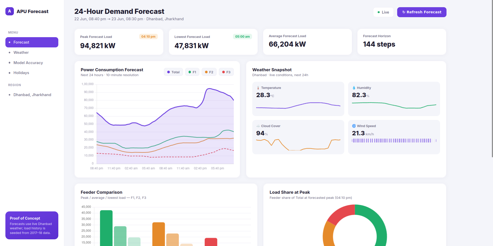

# ⚡ APU Forecast — Power Demand Prediction System

A production-ready machine learning system for **24-hour electricity demand forecasting**, combining historical load data with real-time weather inputs.

---

## 🚀 Overview

This project predicts short-term electricity demand using:

* 📊 **LightGBM models**
* 🌦️ **Weather data integration**
* 🧠 **Time-series feature engineering**
* ⚡ **FastAPI backend**
* 📈 **Interactive dashboard (Chart.js)**
* 🐳 **Docker deployment**


## 📸 Dashboard Preview

Below is the interactive dashboard showing:

* 24-hour demand forecast
* Feeder-wise consumption (F1, F2, F3)
* Weather snapshot (temperature, humidity, cloud cover, wind)
* Peak load insights and distribution



---

## 🖥️ What the Dashboard Shows

* **Power Consumption Forecast**
  Visualizes total and feeder-wise demand over the next 24 hours.

* **Weather Snapshot**
  Displays real-time weather conditions used by the model.

* **Feeder Comparison**
  Compares peak, average, and lowest loads across feeders.

* **Load Share at Peak**
  Pie chart showing contribution of each feeder at peak demand.

---

---

## 🌐 Live Demo

Access the deployed application here:

👉 https://apu-forecast-5i8z.onrender.com

👉 https://apu-forecast-production.up.railway.app
> Note: The app may take 30–60 seconds to load on first visit due to cold start (Render free tier).

## 🧱 Project Structure

```
main/
├── backend/
│   ├── app/
│   │   ├── main.py
│   │   ├── forecasting.py
│   │   ├── weather.py
│   │   ├── holidays_calendar.py
│   │
│   ├── models/
│
├── frontend/
│   ├── index.html
│   ├── app.js
│   ├── chart.umd.js
│
├── Dockerfile
├── requirements.txt
```

---

## 🌐 API Endpoints

### 🔹 `/forecast`

Returns 24-hour demand predictions.

### 🔹 `/context`

Returns weather + contextual features.

---

## ⚙️ Setup Instructions (Local)

### 1. Clone repository

```bash
git clone https://github.com/anishtoppo55/apu-forecast.git
cd main
```

---

### 2. Create virtual environment

```bash
python3 -m venv .venv
source .venv/bin/activate
```

---

### 3. Install dependencies

```bash
pip install -r requirements.txt
```

---

### 4. Run backend server (IMPORTANT)

Since the project uses a nested module structure, you must set `PYTHONPATH`:

```bash
PYTHONPATH=backend uvicorn backend.app.main:app --reload
```

---

### 5. Open application

```
http://localhost:8000
```

---

## 🐳 Docker Setup

### 1. Build Docker image

```bash
docker build -t apu-forecast .
```

---

### 2. Run container

```bash
docker run -p 8000:10000 apu-forecast
```

---

### 3. Access application

```
http://localhost:8000
```

---

## ⚠️ Docker Notes

* Includes system dependency for LightGBM (`libgomp1`)
* Uses local Chart.js (no CDN)
* PYTHONPATH is configured inside container

---

## ☁️ Deployment (Render)

1. Push code to GitHub
2. Create Web Service on Render
3. Select Docker environment
4. Set port to:

```
10000
```

Update Dockerfile:

```dockerfile
CMD ["uvicorn", "backend.app.main:app", "--host", "0.0.0.0", "--port", "10000"]
```

---

## ⚠️ Notes

* Uses Open-Meteo API for weather data
* Models trained on historical (2017–2018) data
* Free-tier deployments may have cold start delays

---

## 📊 Features

* 24-hour load forecasting
* Feeder-wise prediction (F1, F2, F3)
* Weather-aware modeling
* Interactive dashboard
* Fully containerized

---

## 🚀 Future Improvements

* Real-time streaming predictions
* Model retraining pipeline
* Multi-region forecasting

---

## 👤 Author

Developed as part of a Data Science / ML system project.
